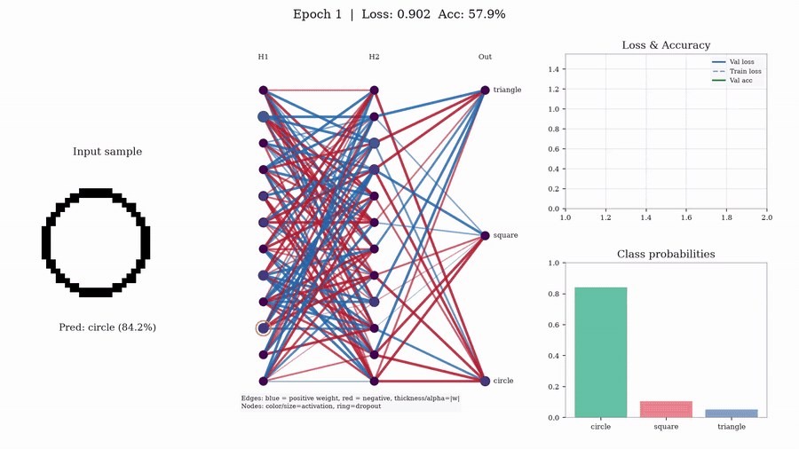
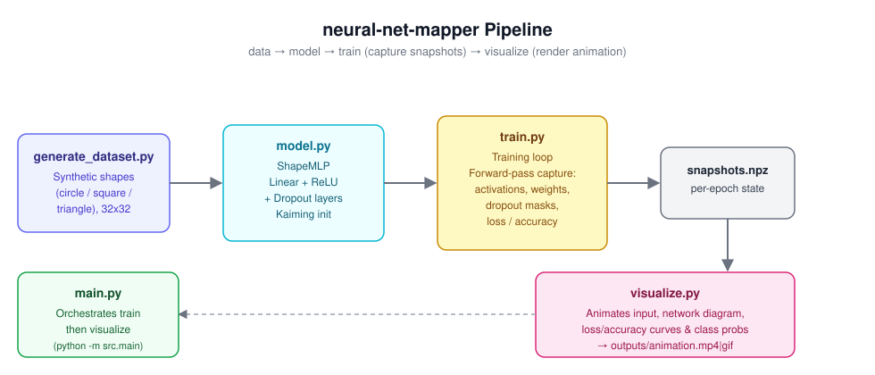
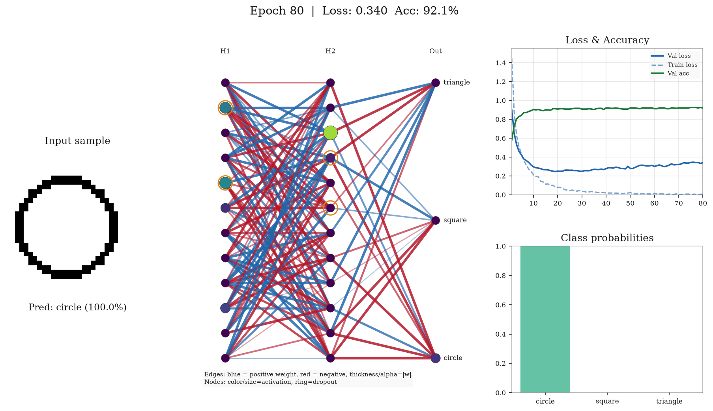

# neural-net-mapper

[](https://github.com/imjbassi/neural-net-mapper/actions/workflows/ci.yml)

An interactive Python tool that trains a multi-layer perceptron (MLP) with dropout on a synthetic shapes dataset and maps its inner workings over time. It visualizes neuron activations, weight magnitudes/signs, predictions, and live training loss/accuracy through animated network diagrams using Matplotlib.



*The network learning to classify randomly placed outline shapes over 80 epochs (dark theme, interpolated frames). A full-quality 1080p MP4 of the same run is at [`assets/demo_video.mp4`](assets/demo_video.mp4).*

## Architecture / Pipeline



## Sample Frame



## Quick Start

1. **Install dependencies**

   ```bash
   pip install -r requirements.txt
   ```

2. **Train and render** (saves `outputs/animation.mp4`, falls back to `.gif` if ffmpeg is unavailable)

   ```bash
   python -m src.main
   ```

3. **Re-render from saved snapshots** (skips training)

   ```bash
   python -m src.main --render-only
   ```

## Command-Line Options

Everything is configurable from the CLI — no source edits needed:

```bash
python -m src.main --epochs 100 --hidden-sizes 256 128 64 --dropout 0.4 \
    --lr 1e-3 --format gif --fps 4 --save-frame --seed 7
```

| Flag | Default | Description |
|------|---------|-------------|
| `--epochs` | 60 | Number of training epochs |
| `--sample-every` | 5 | Capture a snapshot every N epochs |
| `--hidden-sizes` | 128 64 | Hidden layer sizes (space-separated) |
| `--dropout` | 0.3 | Dropout probability |
| `--n-per-class` | 300 | Samples per shape class |
| `--lr` | 3e-4 | Adam learning rate |
| `--batch-size` | 32 | Mini-batch size |
| `--seed` | 42 | Random seed |
| `--device` | auto | Torch device (`cpu` / `cuda`) |
| `--uncentered` | off | Scatter shapes randomly instead of centering (harder task) |
| `--outline` | off | Draw shape outlines instead of filled shapes (harder task) |
| `--jitter` | 2 | Max pixel jitter for centered shapes |
| `--thickness` | 2 | Outline thickness with `--outline` |
| `--output-dir` | outputs | Where snapshots and animations are written |
| `--format` | mp4 | Animation format (`mp4` or `gif`) |
| `--fps` | 2 | Animation frames per second |
| `--top-k-edges` | 8 | Strongest edges drawn per node |
| `--theme` | light | Visual theme: `light` or `dark` (neon glow style) |
| `--smooth` | 1 | Interpolated frames per snapshot for fluid motion |
| `--dpi` | 120 | Output resolution |
| `--save-frame` | off | Also save the final frame as a PNG |
| `--render-only` | off | Skip training, re-render from `snapshots.npz` |
| `--quiet` | off | Suppress per-epoch progress output |

To reproduce the demo video above (smooth 1080p dark-theme MP4):

```bash
pip install imageio-ffmpeg   # bundled ffmpeg for MP4 export
python -m src.main --epochs 80 --sample-every 1 --n-per-class 400 \
    --uncentered --outline --theme dark --smooth 4 --fps 24 --dpi 150
```

The `--uncentered --outline` combination makes the task genuinely hard (the MLP has to cope with shapes appearing anywhere in the frame), so the video shows a real learning arc instead of instant convergence.

MP4 export uses the system ffmpeg if present, falls back to the `imageio-ffmpeg` bundled binary, and finally to an animated GIF if neither is available.

Run `python -m src.main --help` for the full list. The standalone renderer also has its own CLI: `python -m src.visualize --input outputs/snapshots.npz --output anim.gif`.

## Visualization Guide

- **Left Panel**: Input sample (32x32 image) with predicted class and confidence score
- **Middle Panel**: Network diagram
  - **Nodes**: Color and size represent activation magnitude (consistent global scale across frames)
  - **Edges**:
    - Green = positive weight, red = negative weight
    - Thickness and opacity proportional to |weight|
    - Top-k connections per node shown for clarity
  - **Red ring**: Indicates neuron dropped by dropout in current epoch snapshot
- **Right Top Panel**: Training/validation loss and validation accuracy curves over epochs
- **Right Bottom Panel**: Class probability distribution bars

## Project Structure

```
neural-net-mapper/
├── pyproject.toml                # Project metadata and pytest configuration
├── requirements.txt              # Python dependencies
├── assets/                       # README images/diagrams
├── .github/workflows/ci.yml     # GitHub Actions test workflow
├── data/
│   ├── __init__.py
│   └── generate_dataset.py       # Synthetic dataset generation (centered shapes, jitter, fill/outline)
├── src/
│   ├── __init__.py
│   ├── model.py                  # MLP architecture with dropout (Kaiming initialization)
│   ├── train.py                  # Training loop and snapshot capture
│   ├── visualize.py              # Animation renderer
│   └── main.py                   # CLI entry point
├── tests/                        # Pytest suite (dataset, model, training, rendering, CLI)
└── outputs/                      # Generated animations and snapshots
```

## Testing

```bash
pip install pytest
pytest
```

The suite covers dataset generation, model construction/validation, a tiny end-to-end training run, snapshot integrity, animation rendering, and the CLI. It runs in CI on every push and pull request.

## Features

- **Synthetic Dataset**: Generates geometric shapes (circles, squares, triangles) with configurable jitter and rendering styles
- **Dropout Visualization**: Real-time display of which neurons are dropped during training
- **Weight Analysis**: Visual representation of connection strengths and signs
- **Training Metrics**: Train loss, validation loss, and validation accuracy tracked and plotted live
- **Leak-Free Preprocessing**: Inputs are standardized with a global mean/std computed from the training set only (after the train/val split); per-pixel stats are avoided since near-constant pixels make them numerically explosive
- **Demo Mode**: Dark neon theme with glow effects and frame interpolation for smooth, presentation-ready videos
- **Flexible Architecture**: Configurable hidden layer sizes and dropout rates from the CLI
- **Reproducible**: Seed-based initialization; the dropout-mask capture pass is RNG-isolated so it never perturbs training

## Requirements

- Python 3.9+
- PyTorch
- Matplotlib
- NumPy
- Pillow
- scikit-learn
